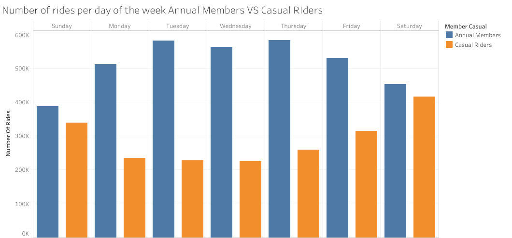
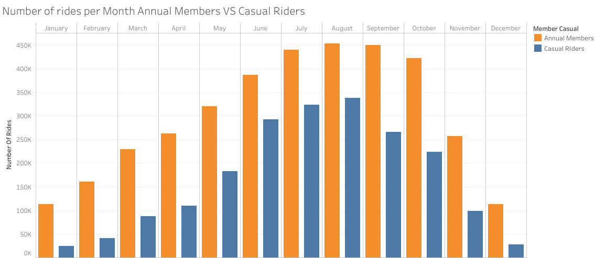
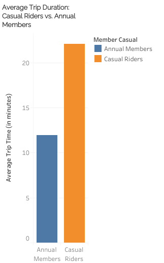
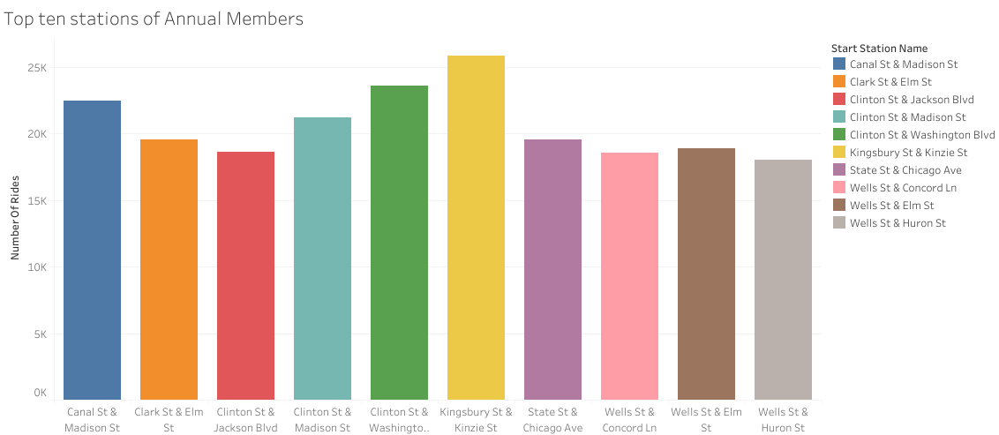
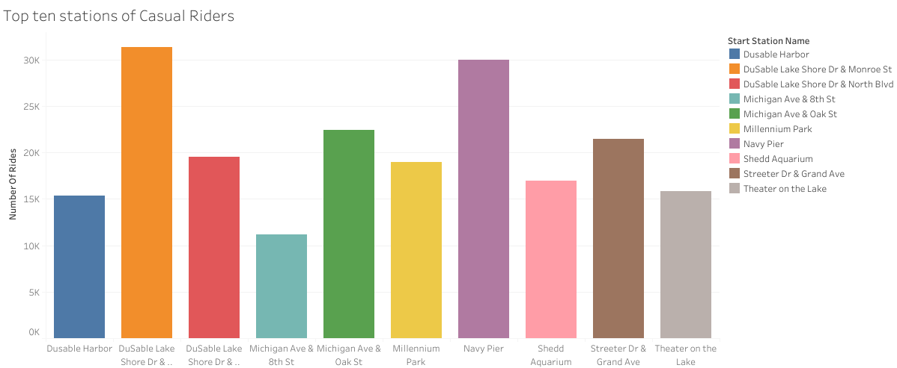

# Cyclistic Bike-Share Analysis: Converting Casual Riders to Annual Members
**Google Data Analytics Capstone Project Case Study**

---

## Project Overview
As a Junior Data Analyst at Cyclistic, a prominent bike-share company based in Chicago, this case study aims to analyze historical trip data to uncover distinct behavioral patterns between two user categories: **Casual Riders** (single-ride and full-day passes) and **Annual Members** (annual passes). 

Since financial analysts concluded that annual members are significantly more profitable, the Director of Marketing, Lily Moreno, has set a clear business goal: **Design data-driven marketing strategies to convert existing casual riders into long-term annual members.**

### Key Business Question
* **How do annual members and casual riders use Cyclistic bikes differently?**

---

## Technical Stack
* **Data Processing & Engineering:** Google BigQuery (SQL)
* **Data Visualization:** Tableau Public
* **Framework:** Data Analysis Life Cycle (Ask, Prepare, Process, Analyze, Share, Act)

---

## Phase 1 & 2: Prepare & Process (Data Integrity)
The analysis utilizes Cyclistic’s historical trip data from **April 2025 to March 2026** (over 5 million records), made publicly available by Motivate International Inc. 
* **Data Privacy:** To comply with data privacy policies, all personal identifiable information (PII) of riders was strictly omitted.
* **Data Quality Control:** Using BigQuery SQL, the dataset was cleaned by removing duplicate entries, filtering out null stations, eliminating records with missing critical parameters, and ensuring all trip start times occurred chronologically before end times (`started_at < ended_at`).

---

## Phase 3: Analyze (SQL Code Snippets)

Here are the optimized BigQuery SQL queries used to aggregate and extract insights from the cleaned dataset.

### 1. Trip Duration Breakdown by User Type
```sql
SELECT member_casual,
       COUNT(ride_id) AS number_of_rides,
       ROUND(AVG(TIMESTAMP_DIFF(ended_at, started_at, MINUTE)), 2) AS average_trip_time
FROM `first-case-cyclist-bikeshare.Cyclistic_data.combined_trips_clean` 
WHERE started_at < ended_at
GROUP BY member_casual;
```
### 2. Hourly Trends (Commuter vs. Leisure Patterns)
```SQL
SELECT member_casual,
       EXTRACT(HOUR FROM started_at) AS hour_of_day,
       COUNT(ride_id) AS total_rides 
FROM `first-case-cyclist-bikeshare.Cyclistic_data.combined_trips_clean`
GROUP BY member_casual, hour_of_day
ORDER BY member_casual, hour_of_day;
```
### 3. Weekly Distribution (Day of the Week)
```SQL
SELECT member_casual,
       EXTRACT(DAYOFWEEK FROM started_at) AS day_number_of_week,
       FORMAT_TIMESTAMP("%A", started_at) AS day_of_week,
       COUNT(ride_id) AS number_of_rides 
FROM `first-case-cyclist-bikeshare.Cyclistic_data.combined_trips_clean`
GROUP BY member_casual, day_number_of_week, day_of_week
ORDER BY member_casual, day_number_of_week;
```
### 4. Top 10 Stations by User Group
```SQL
SELECT member_casual,
       start_station_name,
       COUNT(ride_id) AS number_of_rides 
FROM `first-case-cyclist-bikeshare.Cyclistic_data.combined_trips_clean`
WHERE start_station_name IS NOT NULL
GROUP BY start_station_name, member_casual
ORDER BY member_casual, number_of_rides DESC
LIMIT 10;
```
## Phase 4: Share (Key Visual Insights)
### 1. Hourly trends (Commuter vs. Leisure Patterns)


* **Annual members** show two massive, sharp spikes every single day: right at **8:00 AM** and again at **5:00 PM**. Outside of those hours, their activity drops significantly.
* **Casual riders** do not have sharp morning or evening spikes. Instead, their line forms a gradual, smooth wave that slowly builds throughout the morning, peaks in the late afternoon between **2:00 PM** and **4:00 PM**, and steadily tapers off after sunset.

### 2. Weekly Distribution (Workweek Stability vs. Weekend Warriors)


* **Annual members** maintain a steady, highly consistent riding schedule throughout the **workweek**, whereas **Casual riders** are heavily "Weekend Warriors" whose volume explodes on Saturdays and Sundays.
* **Members** own the weekdays by a massive margin, but the **gap** completely **narrows** during the weekend due to the **massive influx** of **casual users**.

### 3. Monthly Seasonality (Winter Resilience vs. Summer Surges)


* **The Summer Peak (July–October):** Both user groups hit their absolute highest volumes during these months. Warm weather and tourism drive an explosive peak for casual riders.
* **The Permanent Member Gap:** Annual members maintain a higher volume of rides over casual riders every single month of the year.
* **The Winter Collapse (December–February):** Casual ridership drops almost entirely to zero during freezing winter months. Member ridership dips significantly as well but continues to maintain a steady baseline of hundreds of thousands of rides.

### 4. Average Trip Duration (Efficiency vs. Exploration)


* **The Casual Leisure Cruise:** Casual riders maintain an average trip duration that is 2 times longer than annual members year-round.
* **The Member Sprint:** Annual member trips are remarkably short and consistent, typically averaging between 10 to 13 minutes per ride.

### 5. Top Starting Stations (Geographic Concentration)


* **Annual Members**
**#1 Station:** **Kingsbury St & Kinzie St** (serves the Merchandise Mart and heavy corporate tech offices).
Top Runners-Up: **Clinton St & Washington Blvd and Canal St & Madison St** (positioned directly outside Chicago's major commuter rail terminals).



* **Casual Riders**
**#1 Station:** **DuSable Lake Shore Dr & Monroe St** (situated right at Millennium Park and the Lakefront Trail).
Top Runners-Up: **Navy Pier and Michigan Ave & Oak St** (prime locations for out-of-town sightseeing and luxury retail).

---

## Phase 5: Act (Strategic Recommendations)

Based on the core data discoveries from this analysis, three targeted, data-driven recommendations were delivered to Marketing Director Lily Moreno to maximize casual-to-member conversion rates:

* Annual members use Cyclistic as a practical daily utility (commuting), while casual riders use it as an   experiential luxury (recreation and tourism). Therefore, marketing campaigns should not try to sell the concept of "commuting" to casual riders; instead, they must frame the annual membership as a premier pass for lifestyle, fitness, and weekend exploration.

* Members value the bike network for its speed and convenience, whereas casual riders value it for time-based exploration. This means casual riders are frequently paying high, out-of-pocket, accumulating costs via single-ride or full-day passes. Our digital media strategy should focus heavily on the financial pain point: showing casual riders the mathematical proof that an annual membership will save them significant money based on their long ride times.

* Casual rider activity is highly concentrated rather than spread across the city landscape. This is a massive win for Cyclistic's marketing budget. We do not need a broad, expensive, city-wide advertising campaign. Instead, Cyclistic can maximize its return on investment (ROI) by deploying a highly localized, geofenced digital media campaign targeting users at the top casual stations specifically during peak summer weekend afternoons.

---

## Contact & Professional Links
Thank you for reviewing my Cyclistic Bike-Share Case Study! Feel free to connect or reach out if you have any questions regarding my methodologies or insights.

* **Author Name:** Yash Tiwari
* **Professional Email:** yashtiwarigkp@gmail.com
* **LinkedIn:** [linkedin.com/in/yash-tiwari-52601120a](https://www.linkedin.com/in/yash-tiwari-52601120a)
