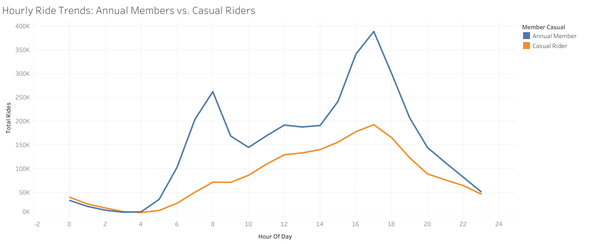

# Cyclistic Bike-Share Analysis: Converting Casual Riders to Annual Members
**Google Data Analytics Capstone Project Case Study**

---

## Project Overview
As a Junior Data Analyst at Cyclistic, a prominent bike-share company based in Chicago, this case study aims to analyze historical trip data to uncover distinct behavioral patterns between two user categories: **Casual Riders** (single-ride and full-day passes) and **Annual Members** (annual passes). 

Since financial analysts concluded that annual members are significantly more profitable, the Director of Marketing, Lily Moreno, has set a clear business goal: **Design data-driven marketing strategies to convert existing casual riders into long-term annual members.**

### Key Business Question
* **How do annual members and casual riders use Cyclistic bikes differently?**

---

## Technical Stack
* **Data Processing & Engineering:** Google BigQuery (SQL)
* **Data Visualization:** Tableau Public
* **Framework:** Data Analysis Life Cycle (Ask, Prepare, Process, Analyze, Share, Act)

---

## Phase 1 & 2: Prepare & Process (Data Integrity)
The analysis utilizes Cyclistic’s historical trip data from **April 2025 to March 2026** (over 5 million records), made publicly available by Motivate International Inc. 
* **Data Privacy:** To comply with data privacy policies, all personal identifiable information (PII) of riders was strictly omitted.
* **Data Quality Control:** Using BigQuery SQL, the dataset was cleaned by removing duplicate entries, filtering out null stations, eliminating records with missing critical parameters, and ensuring all trip start times occurred chronologically before end times (`started_at < ended_at`).

---

## Phase 3: Analyze (SQL Code Snippets)

Here are the optimized BigQuery SQL queries used to aggregate and extract insights from the cleaned dataset.

### 1. Trip Duration Breakdown by User Type
```sql
SELECT member_casual,
       COUNT(ride_id) AS number_of_rides,
       ROUND(AVG(TIMESTAMP_DIFF(ended_at, started_at, MINUTE)), 2) AS average_trip_time
FROM `first-case-cyclist-bikeshare.Cyclistic_data.combined_trips_clean` 
WHERE started_at < ended_at
GROUP BY member_casual;
```
### 2. Hourly Trends (Commuter vs. Leisure Patterns)
```SQL
SELECT member_casual,
       EXTRACT(HOUR FROM started_at) AS hour_of_day,
       COUNT(ride_id) AS total_rides 
FROM `first-case-cyclist-bikeshare.Cyclistic_data.combined_trips_clean`
GROUP BY member_casual, hour_of_day
ORDER BY member_casual, hour_of_day;
```
### 3. Weekly Distribution (Day of the Week)
```SQL
SELECT member_casual,
       EXTRACT(DAYOFWEEK FROM started_at) AS day_number_of_week,
       FORMAT_TIMESTAMP("%A", started_at) AS day_of_week,
       COUNT(ride_id) AS number_of_rides 
FROM `first-case-cyclist-bikeshare.Cyclistic_data.combined_trips_clean`
GROUP BY member_casual, day_number_of_week, day_of_week
ORDER BY member_casual, day_number_of_week;
```
### 4. Top 10 Stations by User Group
```SQL
SELECT member_casual,
       start_station_name,
       COUNT(ride_id) AS number_of_rides 
FROM `first-case-cyclist-bikeshare.Cyclistic_data.combined_trips_clean`
WHERE start_station_name IS NOT NULL
GROUP BY start_station_name, member_casual
ORDER BY member_casual, number_of_rides DESC
LIMIT 10;
```
## Phase 4: Share (Key Visual Insights)
### 1. Hourly trends (Commuter vs. Leisure Patterns)


* **Annual members** show two massive, sharp spikes every single day: right at **8:00 AM** and again at **5:00 PM**. Outside of those hours, their activity drops significantly.
* **Casual riders** do not have sharp morning or evening spikes. Instead, their line forms a gradual, smooth wave that slowly builds throughout the morning, peaks in the late afternoon between **2:00 PM** and **4:00 PM**, and steadily tapers off after sunset.
